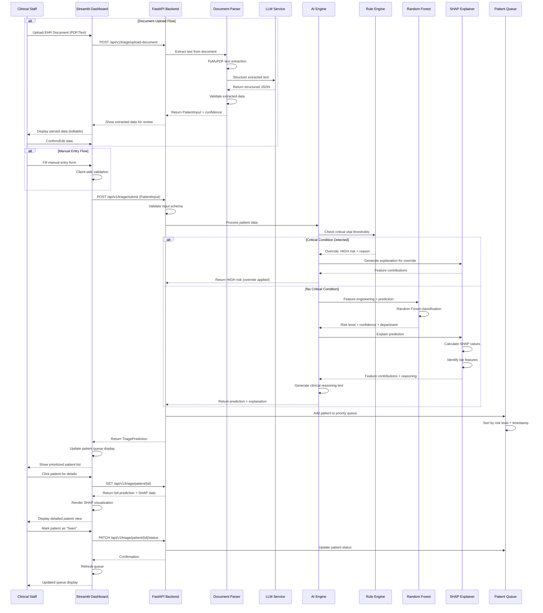
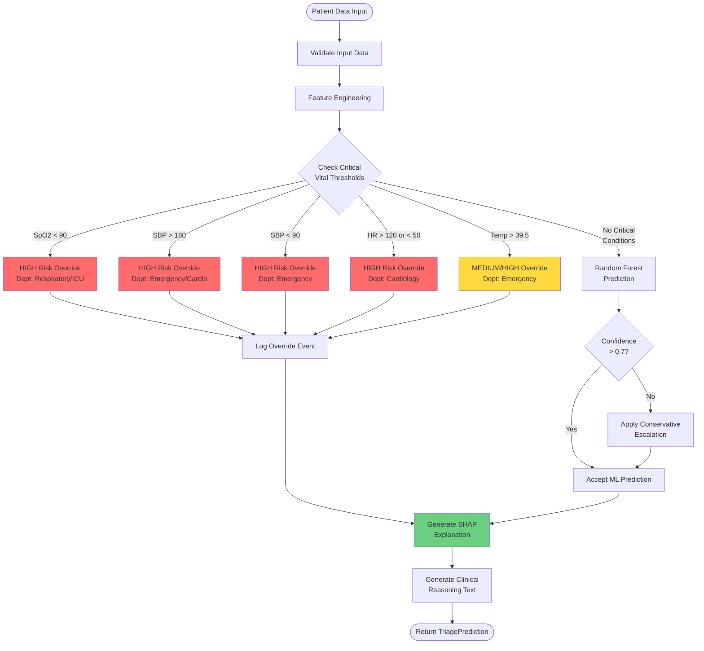

# Design Document: AI-Powered Smart Patient Triage System

## 1. System Architecture Overview

### 1.1 High-Level Architecture

The system follows a modular, layered architecture with clear separation of concerns:

```
┌─────────────────────────────────────────────────────────────┐
│                    Streamlit Dashboard                       │
│                  (Clinical Interface Layer)                  │
└─────────────────────┬───────────────────────────────────────┘
                      │ HTTP/REST
┌─────────────────────▼───────────────────────────────────────┐
│                    FastAPI Backend                           │
│                   (API Gateway Layer)                        │
└─────┬───────────────┬───────────────┬──────────────────────┘
      │               │               │
      ▼               ▼               ▼
┌──────────┐   ┌─────────────┐   ┌──────────────┐
│ Document │   │  AI Engine  │   │ Data Manager │
│  Parser  │   │   (ML+Rules)│   │  (Validation)│
└──────────┘   └──────┬──────┘   └──────────────┘
                      │
                      ▼
               ┌─────────────┐
               │    SHAP     │
               │ Explainer   │
               └─────────────┘
```

### 1.2 Core Components

1. **API Layer (FastAPI)**: RESTful endpoints for data submission and retrieval
2. **Document Parser**: PDF/Text extraction and LLM-based structuring
3. **AI Engine**: Hybrid ML + Rule-based classification system
4. **Explainability Module**: SHAP-based feature importance and reasoning generation
5. **Dashboard (Streamlit)**: Real-time patient queue visualization

## 2. Detailed Component Design

### 2.1 Data Models (Pydantic Schemas)


```python
from pydantic import BaseModel, Field, validator
from typing import List, Optional, Dict
from enum import Enum
from datetime import datetime

# Enumerations
class Gender(str, Enum):
    MALE = "male"
    FEMALE = "female"
    OTHER = "other"
    UNKNOWN = "unknown"

class RiskLevel(str, Enum):
    LOW = "low"
    MEDIUM = "medium"
    HIGH = "high"

class Department(str, Enum):
    EMERGENCY = "emergency"
    CARDIOLOGY = "cardiology"
    RESPIRATORY = "respiratory"
    GENERAL_MEDICINE = "general_medicine"
    PEDIATRICS = "pediatrics"
    ICU = "icu"

# Input Models
class VitalSigns(BaseModel):
    heart_rate: int = Field(..., ge=30, le=200, description="Heart rate in bpm")
    systolic_bp: int = Field(..., ge=60, le=250, description="Systolic BP in mmHg")
    diastolic_bp: int = Field(..., ge=40, le=150, description="Diastolic BP in mmHg")
    temperature: float = Field(..., ge=35.0, le=42.0, description="Temperature in Celsius")
    spo2: int = Field(..., ge=70, le=100, description="Oxygen saturation percentage")
    
    @validator('diastolic_bp')
    def validate_bp_relationship(cls, v, values):
        if 'systolic_bp' in values and v >= values['systolic_bp']:
            raise ValueError('Diastolic BP must be less than Systolic BP')
        return v

class PatientInput(BaseModel):
    age: int = Field(..., ge=0, le=120, description="Patient age in years")
    gender: Gender
    vitals: VitalSigns
    pre_existing_conditions: List[str] = Field(default_factory=list, description="List of conditions")
    symptoms: str = Field(..., max_length=1000, description="Patient symptoms description")
    chief_complaint: Optional[str] = Field(None, max_length=500)
    
    class Config:
        json_schema_extra = {
            "example": {
                "age": 65,
                "gender": "male",
                "vitals": {
                    "heart_rate": 110,
                    "systolic_bp": 160,
                    "diastolic_bp": 95,
                    "temperature": 38.5,
                    "spo2": 92
                },
                "pre_existing_conditions": ["Hypertension", "Diabetes"],
                "symptoms": "Chest pain, shortness of breath, sweating"
            }
        }

# Output Models
class FeatureContribution(BaseModel):
    feature_name: str
    value: float
    contribution: float
    impact: str  # "increases" or "decreases" risk

class TriagePrediction(BaseModel):
    patient_id: str
    risk_level: RiskLevel
    confidence_score: float = Field(..., ge=0.0, le=1.0)
    recommended_departments: List[Department]
    reasoning: str
    override_applied: bool
    override_reason: Optional[str] = None
    feature_contributions: List[FeatureContribution]
    timestamp: datetime
    
    class Config:
        json_schema_extra = {
            "example": {
                "patient_id": "PT-2024-001",
                "risk_level": "high",
                "confidence_score": 0.89,
                "recommended_departments": ["cardiology", "emergency"],
                "reasoning": "High risk classification due to elevated heart rate (110 bpm), high blood pressure (160/95), and symptoms indicating possible cardiac event. Patient has history of hypertension.",
                "override_applied": True,
                "override_reason": "Systolic BP > 160 mmHg triggered safety override",
                "feature_contributions": [],
                "timestamp": "2024-02-14T10:30:00"
            }
        }

class DocumentUploadResponse(BaseModel):
    success: bool
    extracted_data: Optional[PatientInput] = None
    confidence: float
    raw_text: str
    errors: List[str] = Field(default_factory=list)

class QueueStatus(BaseModel):
    total_patients: int
    high_risk_count: int
    medium_risk_count: int
    low_risk_count: int
    average_wait_time: Optional[float] = None
```

### 2.2 API Endpoints Design


```python
# FastAPI Endpoint Structure

# POST /api/v1/triage/submit
# Submit patient data for triage assessment
# Request Body: PatientInput
# Response: TriagePrediction

# POST /api/v1/triage/upload-document
# Upload and parse EHR document
# Request: multipart/form-data (file)
# Response: DocumentUploadResponse

# GET /api/v1/triage/queue
# Get current patient queue sorted by priority
# Response: List[TriagePrediction]

# GET /api/v1/triage/patient/{patient_id}
# Get detailed information for specific patient
# Response: TriagePrediction with full SHAP visualization data

# GET /api/v1/triage/stats
# Get queue statistics
# Response: QueueStatus

# PATCH /api/v1/triage/patient/{patient_id}/status
# Update patient status (seen, in_progress, completed)
# Request Body: {"status": "seen"}
# Response: {"success": true}
```

### 2.3 AI Engine Architecture

#### 2.3.1 Hybrid Classification Pipeline

```
Input Data
    │
    ▼
┌─────────────────────┐
│ Feature Engineering │
│ - Normalize vitals  │
│ - Encode conditions │
│ - Vectorize symptoms│
└──────────┬──────────┘
           │
           ▼
┌─────────────────────┐      ┌──────────────────┐
│  Rule-Based Check   │─────▶│  CRITICAL ALERT  │
│  (Safety Overrides) │ YES  │  Force High Risk │
└──────────┬──────────┘      └──────────────────┘
           │ NO
           ▼
┌─────────────────────┐
│  Random Forest      │
│  Classifier         │
│  - Risk Level       │
│  - Department       │
└──────────┬──────────┘
           │
           ▼
┌─────────────────────┐
│  Confidence Check   │
│  Low confidence?    │
└──────────┬──────────┘
           │
           ▼
┌─────────────────────┐
│  Final Decision     │
│  + SHAP Explanation │
└─────────────────────┘
```

#### 2.3.2 Rule-Based Safety Overrides


```python
# Critical Vital Thresholds (Always Override ML Prediction)

CRITICAL_RULES = {
    "spo2_critical": {
        "condition": lambda vitals: vitals.spo2 < 90,
        "risk": RiskLevel.HIGH,
        "departments": [Department.RESPIRATORY, Department.ICU],
        "reason": "Critical oxygen saturation < 90%"
    },
    "bp_hypertensive_crisis": {
        "condition": lambda vitals: vitals.systolic_bp > 180,
        "risk": RiskLevel.HIGH,
        "departments": [Department.EMERGENCY, Department.CARDIOLOGY],
        "reason": "Hypertensive crisis: Systolic BP > 180 mmHg"
    },
    "bp_hypotensive": {
        "condition": lambda vitals: vitals.systolic_bp < 90,
        "risk": RiskLevel.HIGH,
        "departments": [Department.EMERGENCY],
        "reason": "Hypotension: Systolic BP < 90 mmHg"
    },
    "tachycardia_severe": {
        "condition": lambda vitals: vitals.heart_rate > 120,
        "risk": RiskLevel.HIGH,
        "departments": [Department.CARDIOLOGY, Department.EMERGENCY],
        "reason": "Severe tachycardia: HR > 120 bpm"
    },
    "bradycardia_severe": {
        "condition": lambda vitals: vitals.heart_rate < 50,
        "risk": RiskLevel.HIGH,
        "departments": [Department.CARDIOLOGY, Department.EMERGENCY],
        "reason": "Severe bradycardia: HR < 50 bpm"
    },
    "fever_high": {
        "condition": lambda vitals: vitals.temperature > 39.5,
        "risk": RiskLevel.MEDIUM,  # Can escalate to HIGH with other symptoms
        "departments": [Department.EMERGENCY],
        "reason": "High fever: Temperature > 39.5°C"
    }
}

# Pediatric Adjustments (Age < 18)
PEDIATRIC_RULES = {
    "pediatric_fever": {
        "condition": lambda age, vitals: age < 2 and vitals.temperature > 38.0,
        "risk": RiskLevel.HIGH,
        "departments": [Department.PEDIATRICS, Department.EMERGENCY],
        "reason": "Infant with fever > 38°C requires immediate assessment"
    }
}
```

#### 2.3.3 Feature Engineering


```python
# Features for Random Forest Model

NUMERICAL_FEATURES = [
    'age',
    'heart_rate',
    'systolic_bp',
    'diastolic_bp',
    'temperature',
    'spo2',
    'pulse_pressure',  # Derived: systolic - diastolic
    'map',  # Mean Arterial Pressure: diastolic + (pulse_pressure/3)
]

CATEGORICAL_FEATURES = [
    'gender',
    'has_cardiac_history',  # Derived from pre_existing_conditions
    'has_respiratory_history',
    'has_diabetes',
    'has_hypertension',
]

TEXT_FEATURES = [
    'symptom_embeddings',  # TF-IDF or simple keyword matching for hackathon
    'symptom_severity_score',  # Keyword-based severity (chest pain, bleeding, etc.)
]

# Feature Importance Tracking
# SHAP will identify which features contribute most to each prediction
```

### 2.4 Document Parser Design

#### 2.4.1 Parsing Pipeline

```
PDF/Text Upload
    │
    ▼
┌─────────────────────┐
│  PyMuPDF Extraction │
│  - Extract text     │
│  - Preserve layout  │
└──────────┬──────────┘
           │
           ▼
┌─────────────────────┐
│  Text Preprocessing │
│  - Clean formatting │
│  - Identify sections│
└──────────┬──────────┘
           │
           ▼
┌─────────────────────┐
│  LLM Structuring    │
│  - Extract vitals   │
│  - Parse conditions │
│  - Extract symptoms │
└──────────┬──────────┘
           │
           ▼
┌─────────────────────┐
│  Validation         │
│  - Check completeness│
│  - Flag uncertainties│
└──────────┬──────────┘
           │
           ▼
┌─────────────────────┐
│  Return Structured  │
│  PatientInput       │
└─────────────────────┘
```

#### 2.4.2 LLM Prompt Template


```python
EXTRACTION_PROMPT = """
You are a medical data extraction assistant. Extract structured patient information from the following clinical text.

Clinical Text:
{document_text}

Extract and return ONLY a JSON object with the following structure:
{{
    "age": <integer>,
    "gender": "<male|female|other|unknown>",
    "vitals": {{
        "heart_rate": <integer>,
        "systolic_bp": <integer>,
        "diastolic_bp": <integer>,
        "temperature": <float>,
        "spo2": <integer>
    }},
    "pre_existing_conditions": [<list of condition strings>],
    "symptoms": "<description of symptoms>",
    "chief_complaint": "<main complaint>"
}}

Rules:
- If a value is not found, use null
- Use standard medical units (bpm, mmHg, Celsius, %)
- Be conservative - only extract clearly stated information
- For symptoms, preserve the original clinical language
"""
```

### 2.5 SHAP Explainability Module

#### 2.5.1 SHAP Integration

```python
import shap

class ExplainabilityEngine:
    def __init__(self, model, feature_names):
        self.model = model
        self.feature_names = feature_names
        # Use TreeExplainer for Random Forest (fast and exact)
        self.explainer = shap.TreeExplainer(model)
    
    def explain_prediction(self, features):
        """
        Generate SHAP values and human-readable explanation
        """
        shap_values = self.explainer.shap_values(features)
        
        # For multi-class, get SHAP values for predicted class
        predicted_class = self.model.predict(features)[0]
        class_shap_values = shap_values[predicted_class]
        
        # Get top contributing features
        feature_contributions = self._get_top_features(
            class_shap_values, 
            features, 
            top_n=5
        )
        
        # Generate reasoning text
        reasoning = self._generate_reasoning(
            feature_contributions,
            predicted_class
        )
        
        return {
            "shap_values": class_shap_values,
            "feature_contributions": feature_contributions,
            "reasoning": reasoning,
            "base_value": self.explainer.expected_value[predicted_class]
        }
    
    def _get_top_features(self, shap_values, features, top_n=5):
        """Extract top N features by absolute SHAP value"""
        contributions = []
        for idx, (shap_val, feature_val) in enumerate(zip(shap_values[0], features[0])):
            contributions.append({
                "feature_name": self.feature_names[idx],
                "value": feature_val,
                "contribution": float(shap_val),
                "impact": "increases" if shap_val > 0 else "decreases"
            })
        
        # Sort by absolute contribution
        contributions.sort(key=lambda x: abs(x["contribution"]), reverse=True)
        return contributions[:top_n]
    
    def _generate_reasoning(self, contributions, risk_level):
        """Generate human-readable clinical reasoning"""
        reasoning_parts = [f"{risk_level.upper()} risk classification based on:"]
        
        for contrib in contributions:
            feature = contrib["feature_name"]
            value = contrib["value"]
            impact = contrib["impact"]
            
            # Create clinical language
            if feature == "spo2":
                reasoning_parts.append(
                    f"- Oxygen saturation of {value}% {impact} risk"
                )
            elif feature == "heart_rate":
                reasoning_parts.append(
                    f"- Heart rate of {value} bpm {impact} risk"
                )
            # ... more feature-specific translations
        
        return " ".join(reasoning_parts)
```

### 2.6 Dashboard Design (Streamlit)

#### 2.6.1 Dashboard Layout


```
┌─────────────────────────────────────────────────────────────┐
│  🏥 Smart Patient Triage System          [Stats] [Refresh]  │
├─────────────────────────────────────────────────────────────┤
│                                                               │
│  📊 Queue Statistics                                         │
│  ┌──────────┬──────────┬──────────┬──────────┐             │
│  │ Total: 12│ 🔴 High:3│ 🟡 Med:5 │ 🟢 Low:4 │             │
│  └──────────┴──────────┴──────────┴──────────┘             │
│                                                               │
│  🚨 Priority Queue                                           │
│  ┌─────────────────────────────────────────────────────┐   │
│  │ 🔴 PT-001 | Age:65 | HR:110 | BP:160/95 | SpO2:92  │   │
│  │    Dept: Cardiology, Emergency                       │   │
│  │    Reason: High BP + Chest pain symptoms             │   │
│  │    [View Details] [Mark Seen]                        │   │
│  ├─────────────────────────────────────────────────────┤   │
│  │ 🔴 PT-003 | Age:2 | HR:140 | Temp:39.8°C           │   │
│  │    Dept: Pediatrics, Emergency                       │   │
│  │    Reason: Infant with high fever                    │   │
│  │    [View Details] [Mark Seen]                        │   │
│  ├─────────────────────────────────────────────────────┤   │
│  │ 🟡 PT-002 | Age:45 | HR:88 | BP:130/85             │   │
│  │    Dept: General Medicine                            │   │
│  │    Reason: Moderate symptoms, stable vitals          │   │
│  │    [View Details] [Mark Seen]                        │   │
│  └─────────────────────────────────────────────────────┘   │
│                                                               │
│  ➕ Add New Patient                                          │
│  [Manual Entry] [Upload Document]                            │
└─────────────────────────────────────────────────────────────┘
```

#### 2.6.2 Patient Detail View

```
┌─────────────────────────────────────────────────────────────┐
│  ← Back to Queue          Patient PT-001                     │
├─────────────────────────────────────────────────────────────┤
│                                                               │
│  🔴 HIGH RISK - Confidence: 89%                              │
│  ⚠️  Rule Override Applied: Systolic BP > 160 mmHg          │
│                                                               │
│  👤 Patient Information                                      │
│  Age: 65 | Gender: Male                                      │
│  Conditions: Hypertension, Diabetes                          │
│                                                               │
│  📈 Vital Signs                                              │
│  ┌──────────────┬──────────────┬──────────────┐            │
│  │ HR: 110 bpm  │ BP: 160/95   │ Temp: 38.5°C │            │
│  │ SpO2: 92%    │ MAP: 117     │              │            │
│  └──────────────┴──────────────┴──────────────┘            │
│                                                               │
│  💬 Symptoms                                                 │
│  "Chest pain, shortness of breath, sweating"                │
│                                                               │
│  🎯 Recommended Departments                                  │
│  • Cardiology (Primary)                                      │
│  • Emergency                                                 │
│                                                               │
│  🧠 AI Reasoning                                             │
│  High risk classification due to:                            │
│  - Elevated systolic blood pressure (160 mmHg)               │
│  - Tachycardia (110 bpm)                                     │
│  - Symptoms consistent with cardiac event                    │
│  - Patient history of hypertension                           │
│                                                               │
│  📊 Feature Importance (SHAP)                                │
│  ┌─────────────────────────────────────────────────────┐   │
│  │ Systolic BP     ████████████████░░░░  +0.45         │   │
│  │ Heart Rate      ███████████░░░░░░░░░  +0.32         │   │
│  │ Age             ██████░░░░░░░░░░░░░░  +0.18         │   │
│  │ Symptoms        ████░░░░░░░░░░░░░░░░  +0.12         │   │
│  │ SpO2            ██░░░░░░░░░░░░░░░░░░  -0.08         │   │
│  └─────────────────────────────────────────────────────┘   │
│                                                               │
│  [Mark as Seen] [Export Report]                              │
└─────────────────────────────────────────────────────────────┘
```

## 3. System Flow Diagram (Mermaid.js)


### 3.1 Complete System Sequence Diagram



### 3.2 AI Engine Decision Flow



## 4. Directory Structure


```
smart-triage-system/
│
├── README.md
├── requirements.txt
├── .env.example
├── .gitignore
│
├── app/
│   ├── __init__.py
│   ├── main.py                      # FastAPI application entry point
│   │
│   ├── api/
│   │   ├── __init__.py
│   │   ├── routes/
│   │   │   ├── __init__.py
│   │   │   ├── triage.py            # Triage endpoints
│   │   │   └── health.py            # Health check endpoints
│   │   └── dependencies.py          # Shared dependencies
│   │
│   ├── models/
│   │   ├── __init__.py
│   │   ├── schemas.py               # Pydantic models (all data schemas)
│   │   └── enums.py                 # Enumerations (RiskLevel, Department, etc.)
│   │
│   ├── services/
│   │   ├── __init__.py
│   │   ├── ai_engine.py             # Main AI orchestration
│   │   ├── ml_classifier.py         # Random Forest model
│   │   ├── rule_engine.py           # Safety override rules
│   │   ├── explainability.py        # SHAP integration
│   │   ├── document_parser.py       # PDF/text parsing
│   │   ├── llm_service.py           # LLM API integration
│   │   └── feature_engineering.py   # Feature transformation
│   │
│   ├── core/
│   │   ├── __init__.py
│   │   ├── config.py                # Configuration management
│   │   ├── constants.py             # Medical thresholds, rules
│   │   └── queue_manager.py         # Patient queue management
│   │
│   └── utils/
│       ├── __init__.py
│       ├── validators.py            # Custom validation logic
│       └── logger.py                # Logging configuration
│
├── dashboard/
│   ├── __init__.py
│   ├── app.py                       # Streamlit main application
│   ├── components/
│   │   ├── __init__.py
│   │   ├── queue_view.py            # Patient queue component
│   │   ├── patient_detail.py        # Detailed patient view
│   │   ├── input_form.py            # Manual entry form
│   │   ├── document_upload.py       # Document upload component
│   │   └── shap_visualization.py    # SHAP charts
│   └── utils/
│       ├── __init__.py
│       └── api_client.py            # FastAPI client wrapper
│
├── ml/
│   ├── __init__.py
│   ├── train_model.py               # Model training script
│   ├── generate_synthetic_data.py   # Synthetic data generation
│   ├── evaluate_model.py            # Model evaluation
│   └── models/
│       └── random_forest_v1.pkl     # Saved model (gitignored)
│
├── data/
│   ├── synthetic/                   # Generated training data
│   ├── sample_documents/            # Sample EHR PDFs for testing
│   └── .gitkeep
│
├── tests/
│   ├── __init__.py
│   ├── test_api/
│   │   ├── __init__.py
│   │   └── test_triage_endpoints.py
│   ├── test_services/
│   │   ├── __init__.py
│   │   ├── test_rule_engine.py      # Critical: test safety overrides
│   │   ├── test_ml_classifier.py
│   │   └── test_document_parser.py
│   └── test_models/
│       ├── __init__.py
│       └── test_schemas.py
│
├── docs/
│   ├── requirements.md              # This document
│   ├── design.md                    # This document
│   ├── api_documentation.md         # API reference
│   └── deployment.md                # Deployment guide
│
└── scripts/
    ├── setup.sh                     # Environment setup
    ├── run_backend.sh               # Start FastAPI
    ├── run_dashboard.sh             # Start Streamlit
    └── run_tests.sh                 # Run test suite
```

## 5. Technology Stack Details

### 5.1 Core Dependencies

```txt
# Backend
fastapi==0.109.0
uvicorn[standard]==0.27.0
pydantic==2.5.0
python-multipart==0.0.6

# ML & AI
scikit-learn==1.4.0
shap==0.44.0
numpy==1.26.3
pandas==2.2.0

# Document Processing
PyMuPDF==1.23.0
python-docx==1.1.0

# LLM Integration
openai==1.10.0
# OR anthropic==0.8.0
# OR use local model with transformers

# Frontend
streamlit==1.30.0
plotly==5.18.0
matplotlib==3.8.2

# Utilities
python-dotenv==1.0.0
requests==2.31.0
pytest==7.4.4
```

### 5.2 Configuration Management


```python
# app/core/config.py

from pydantic_settings import BaseSettings
from typing import Optional

class Settings(BaseSettings):
    # API Configuration
    API_V1_PREFIX: str = "/api/v1"
    PROJECT_NAME: str = "Smart Patient Triage System"
    VERSION: str = "1.0.0"
    
    # CORS
    BACKEND_CORS_ORIGINS: list = ["http://localhost:8501"]  # Streamlit default
    
    # ML Model
    MODEL_PATH: str = "ml/models/random_forest_v1.pkl"
    MODEL_CONFIDENCE_THRESHOLD: float = 0.7
    HIGH_RISK_RECALL_TARGET: float = 0.95
    
    # LLM Configuration
    LLM_PROVIDER: str = "openai"  # or "anthropic", "local"
    OPENAI_API_KEY: Optional[str] = None
    LLM_MODEL: str = "gpt-3.5-turbo"
    LLM_TEMPERATURE: float = 0.1
    LLM_MAX_TOKENS: int = 1000
    
    # Document Processing
    MAX_DOCUMENT_SIZE_MB: int = 10
    SUPPORTED_FORMATS: list = [".pdf", ".txt", ".docx"]
    
    # Queue Management
    MAX_QUEUE_SIZE: int = 500
    QUEUE_RETENTION_HOURS: int = 24
    
    # Safety Settings
    ENABLE_RULE_OVERRIDES: bool = True
    LOG_ALL_PREDICTIONS: bool = True
    
    # Logging
    LOG_LEVEL: str = "INFO"
    
    class Config:
        env_file = ".env"
        case_sensitive = True

settings = Settings()
```

## 6. Safety and Quality Assurance

### 6.1 Testing Strategy

#### Critical Test Cases (Must Pass)

```python
# tests/test_services/test_rule_engine.py

def test_critical_spo2_override():
    """Ensure SpO2 < 90 always triggers HIGH risk"""
    patient = create_patient(spo2=85)
    result = ai_engine.predict(patient)
    assert result.risk_level == RiskLevel.HIGH
    assert result.override_applied == True
    assert "oxygen" in result.reasoning.lower()

def test_hypertensive_crisis_override():
    """Ensure SBP > 180 always triggers HIGH risk"""
    patient = create_patient(systolic_bp=190)
    result = ai_engine.predict(patient)
    assert result.risk_level == RiskLevel.HIGH
    assert result.override_applied == True

def test_no_false_negative_high_risk():
    """Ensure ML never downgrades rule-based HIGH risk"""
    # Create patient with critical vitals
    patient = create_patient(spo2=88, heart_rate=130)
    result = ai_engine.predict(patient)
    assert result.risk_level == RiskLevel.HIGH
    # Even if ML predicts LOW, rules should override

def test_pediatric_fever_override():
    """Ensure infant fever triggers appropriate response"""
    patient = create_patient(age=1, temperature=38.5)
    result = ai_engine.predict(patient)
    assert result.risk_level in [RiskLevel.HIGH, RiskLevel.MEDIUM]
    assert Department.PEDIATRICS in result.recommended_departments
```

### 6.2 Model Performance Metrics

```python
# ml/evaluate_model.py

REQUIRED_METRICS = {
    "high_risk_recall": 0.95,      # Must catch 95% of true HIGH risk cases
    "high_risk_precision": 0.60,   # 60% precision acceptable (safety > efficiency)
    "overall_accuracy": 0.75,      # Overall accuracy target
    "medium_risk_f1": 0.70,        # Balanced for medium risk
    "low_risk_specificity": 0.85,  # Avoid over-triaging low risk
}

def evaluate_with_safety_focus(model, X_test, y_test):
    """
    Evaluate model with emphasis on HIGH risk recall
    """
    predictions = model.predict(X_test)
    
    # Calculate metrics
    metrics = {
        "confusion_matrix": confusion_matrix(y_test, predictions),
        "classification_report": classification_report(y_test, predictions),
        "high_risk_recall": recall_score(y_test, predictions, 
                                         labels=['high'], 
                                         average='micro'),
    }
    
    # Safety check
    if metrics["high_risk_recall"] < REQUIRED_METRICS["high_risk_recall"]:
        raise ValueError(
            f"HIGH risk recall {metrics['high_risk_recall']:.2f} "
            f"below required {REQUIRED_METRICS['high_risk_recall']}"
        )
    
    return metrics
```

### 6.3 Monitoring and Logging

```python
# app/utils/logger.py

import logging
from datetime import datetime

class TriageLogger:
    """Specialized logger for triage decisions"""
    
    @staticmethod
    def log_prediction(patient_input, prediction, execution_time):
        """Log every prediction for audit trail"""
        log_entry = {
            "timestamp": datetime.utcnow().isoformat(),
            "patient_id": prediction.patient_id,
            "risk_level": prediction.risk_level,
            "confidence": prediction.confidence_score,
            "override_applied": prediction.override_applied,
            "departments": prediction.recommended_departments,
            "execution_time_ms": execution_time,
            "vitals": {
                "hr": patient_input.vitals.heart_rate,
                "bp": f"{patient_input.vitals.systolic_bp}/{patient_input.vitals.diastolic_bp}",
                "spo2": patient_input.vitals.spo2,
                "temp": patient_input.vitals.temperature,
            }
        }
        
        logging.info(f"TRIAGE_PREDICTION: {log_entry}")
        
        # Flag for review if low confidence HIGH risk
        if (prediction.risk_level == RiskLevel.HIGH and 
            prediction.confidence_score < 0.8):
            logging.warning(
                f"LOW_CONFIDENCE_HIGH_RISK: {prediction.patient_id} "
                f"(confidence: {prediction.confidence_score:.2f})"
            )
```

## 7. Deployment Strategy

### 7.1 Development Setup

```bash
# scripts/setup.sh

#!/bin/bash

# Create virtual environment
python -m venv venv
source venv/bin/activate  # On Windows: venv\Scripts\activate

# Install dependencies
pip install -r requirements.txt

# Generate synthetic training data
python ml/generate_synthetic_data.py --samples 1000

# Train initial model
python ml/train_model.py

# Run tests
pytest tests/ -v

echo "Setup complete! Run the following to start:"
echo "  Backend:   ./scripts/run_backend.sh"
echo "  Dashboard: ./scripts/run_dashboard.sh"
```

### 7.2 Running the System

```bash
# scripts/run_backend.sh
#!/bin/bash
source venv/bin/activate
uvicorn app.main:app --reload --port 8000

# scripts/run_dashboard.sh
#!/bin/bash
source venv/bin/activate
streamlit run dashboard/app.py --server.port 8501
```

### 7.3 Hackathon Demo Checklist

- [ ] Backend API running on localhost:8000
- [ ] Streamlit dashboard running on localhost:8501
- [ ] Sample patients loaded in queue
- [ ] At least one HIGH risk case with override visible
- [ ] SHAP visualizations rendering correctly
- [ ] Document upload tested with sample EHR PDF
- [ ] All critical safety tests passing
- [ ] Demo script prepared with talking points

## 8. Future Enhancements (Post-Hackathon)

### 8.1 Technical Improvements
- Replace in-memory queue with Redis/PostgreSQL
- Implement WebSocket for real-time dashboard updates
- Add user authentication (JWT-based)
- Deploy with Docker + Kubernetes
- Implement A/B testing framework for model improvements

### 8.2 Clinical Features
- Integration with HL7/FHIR standards
- Bed availability and resource allocation
- Historical patient data and trend analysis
- Multi-language support for diverse populations
- Mobile app for paramedics (pre-hospital triage)

### 8.3 AI Enhancements
- Deep learning models (LSTM for time-series vitals)
- Multi-modal learning (incorporate medical images)
- Federated learning across multiple hospitals
- Continuous learning from clinician feedback
- Uncertainty quantification improvements

## 9. Risk Mitigation

### 9.1 Technical Risks

| Risk | Impact | Mitigation |
|------|--------|------------|
| LLM API failures | High | Implement retry logic, fallback to manual entry |
| Model poor performance | High | Strong rule-based fallback, conservative thresholds |
| Document parsing errors | Medium | Manual review step, confidence scoring |
| Dashboard performance | Low | Pagination, lazy loading, caching |

### 9.2 Clinical Safety Risks

| Risk | Impact | Mitigation |
|------|--------|------------|
| False negative HIGH risk | Critical | High recall target (95%), rule overrides, logging |
| Over-reliance on AI | High | Clear disclaimers, explainability, human-in-loop |
| Data quality issues | High | Strict validation, physiological range checks |
| Bias in training data | Medium | Diverse synthetic data, fairness metrics |

## 10. Success Metrics

### 10.1 Hackathon Judging Criteria

- **Innovation**: Hybrid ML + rule-based approach with full explainability
- **Technical Execution**: Clean architecture, working end-to-end demo
- **Clinical Relevance**: Addresses real ED triage challenges
- **Safety Focus**: Demonstrable high recall for critical cases
- **User Experience**: Intuitive dashboard for clinical staff

### 10.2 Demo Impact Points

1. Show critical vital override in action (SpO2 < 90)
2. Demonstrate SHAP explanation for complex case
3. Highlight queue prioritization with mixed risk levels
4. Show document parsing extracting structured data
5. Emphasize safety-first design philosophy

---

**Document Version**: 1.0  
**Last Updated**: February 14, 2026  
**Author**: Senior Health-Tech Architect  
**Status**: Ready for Implementation
